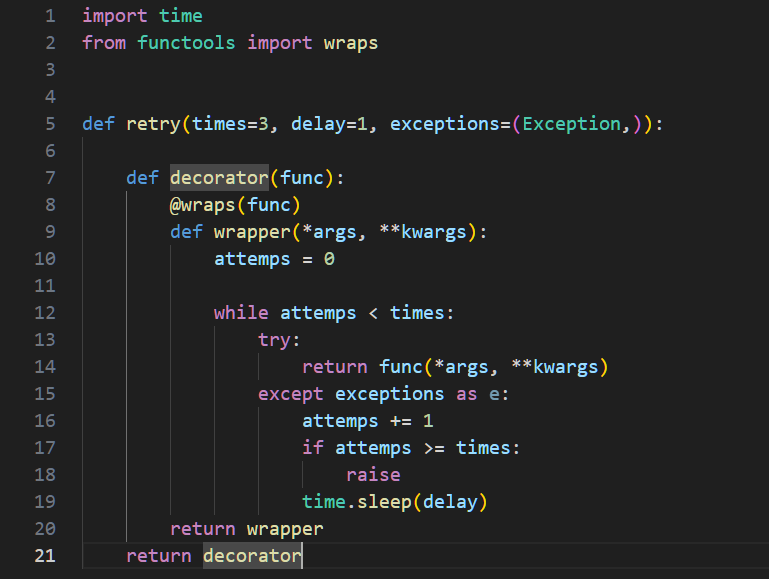

# Веб-приложение для управления списком книг

Это веб-приложение предназначено для управления списком книг с использованием Django и gRPC-сервиса. Приложение поддерживает аутентификацию пользователей, взаимодействует с брокером сообщений и использует базу данных PostgreSQL.

## Оглавление

1. [Требования](#требования)
2. [Установка](#установка)
3. [Запуск](#запуск)
4. [Использование](#использование)
5. [Тестирование](#тестирование)
6. [Дополнительные задания](#дополнительные-задания)
7. [Архитектура](#архитектура)
8. [Скриншоты](#скриншоты)

## Требования

- Python 3.10
- PostgreSQL
- Kafka
- Docker и Docker Compose

## Установка

1. Клонируйте репозиторий:
    ```
        git clone https://github.com/ArthurPanchenko/testovoe_030924.git
        cd testovoe_030924
    ```
2. Создайте виртуальное окружение и активируйте его:
    ```
        python -m venv venv
        source venv/bin/activate  # для Linux/Mac
        venv\Scripts\activate
    ```
3. Установите зависимости:
    ```
        pip install -r requirements.txt
    ```

## Запуск

1. Запустите сервисы с помощью Docker Compose:
    ```
        docker-compose up --build
    ```
2. После успешного запуска приложения, вы можете получить доступ к веб-API по адресу:
    ```
        http://localhost:8000/api/v1/books/
    ```

## Использование

### Веб-API

    * Создание новой книги: POST /api/v1/books/
    * Получение списка всех книг: GET /api/v1/books/
    * Получение информации о книге: GET /api/v1/books/{id}/
    * Обновление книги: PUT /api/v1/books/{id}/
    * Удаление книги: DELETE /api/v1/books/{id}/

### Аутентификация
Для доступа к POST запросам используйте JWT
    Создание пользователя:
        ```
            docker-compose exec web-app python manage.py createsuperuser
        ```
    * Получение токена: POST /api/v1/token

### gRPC-сервис

    * Получение информации о книге по id
    * Получение списка всех книг

## Тестирование
    Веб-API:
        ```
            docker-compose exec web-app python manage.py test
        ```
    gRPC:
        ```
            docker-compose exec service python books_client.py
        ```

## Документация 
    * Swagger для веб-API: /docs
    * gRPC .proto файл: service/core/proto/books.proto

## Дополнительные задания
    * Реализован декоратор @retry в gRPC-сервисе
    
    * Кеширование с помощью redis

## Архитектура
    6 сервисов:
        * Веб-API (web-app)
        * gRPC-сервис (service)
        * postgresql (database)
        * kafka
        * redis
        * zookeeper
    
    Все сервисы запускаются из докера.

    Структура проекта:
        Для сервисов веб-API и gRPC-сервиса есть отдельные папки backend и service соответственно.

        Внутри находятся req.txt и Dockerfile для запуска. 

        В папках /core содержится код проекта (сервиса) который исполняется в изолированном контейнере

## Скриншоты
Запуск gRPC и проверка с помощью клиента (books_client.py) <br>
<br>
Kafka логи<br>
<br>
Docs django<br>
<br>
Декоратор retry<br>
<br>


